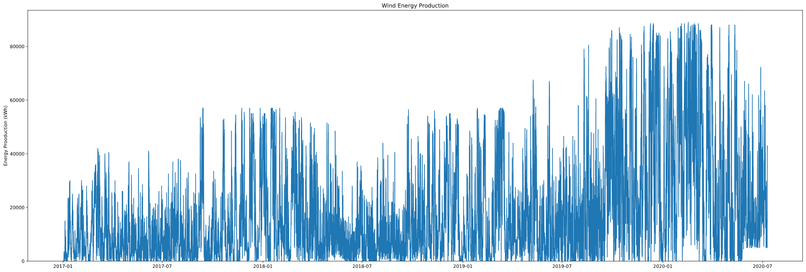
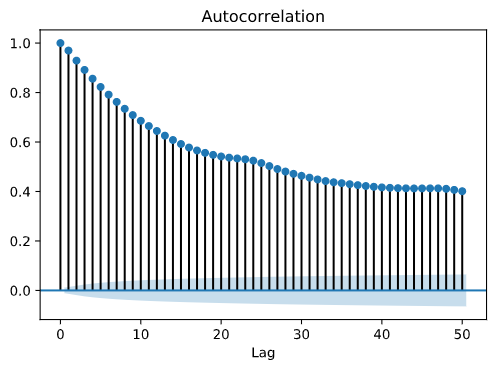
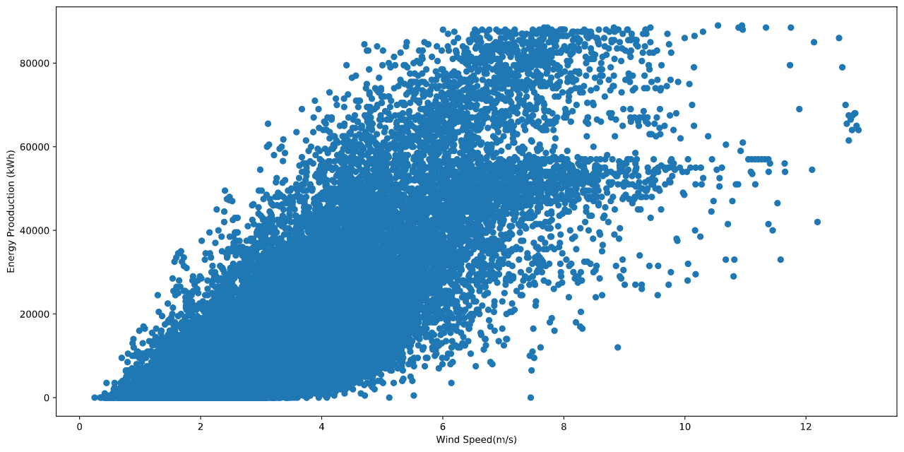

# trading-wind-energy

## Objective
Model for SGInnovate Datathon 2020 July
<br/>
To forecast the wind energy generated by respective wind farms after 18 hours later.

## Packages
```python
import keras 
```


## Preliminary Data Analysis
There are two main datasets - Wind Energy Production and Wind Forecasts. In order to have a rough idea of the features we are going to use in our neural network model, we created several plots to gain a better understanding of the data.

### Wind Energy Production Dataset

As observed in the plot, there is no obvious periodicity(?) Hard to predict


### Wind Speed and Direction of 8 Wind Farms

We averaged the wind speed data from the 8 farms and plotted them against the energy production. It can be seen that there is a positive correlation between the average wind speed and the energy production. Therefore, we are going to take the average wind speed as the second input.

We also plotted the wind direction vs energy production for each wind farm, one of which is shown above. Although the relationship between the two is non linear and less obvious, we still included it as a feature as it is observed that energy production tends to be higher in two directions.

## Data Preprocessing
Speed and direction data are produced every 6 hours. Since we are required to make a prediction every hour, we linearly interpolated the datasets to time base of 1 hour. Missing data in all data sets are also linearly interpolated. Then, as mentioned above, we averaged the wind speed data across the 8 wind farms.\
In order to avoid large data points from dominating the learning, we normalized all our datasets to be between 0 and 1.
```python
def scale_data(data):
    scaler = MinMaxScaler()
    scaler.fit(data)
    return scaler.transform(data)
```

## Persistence as Benchmark
We started off by building a persistence model as our benchmark. Test loss of future models we develop will be compared to the persistence loss.
Used MSE, and got 0.09


## Parameters 
```python
BATCH_SIZE = 32
TIMESTEPS = 24
EPOCH = 100
PATIENCE = 10
LEARNING_RATE = 0.001

```

##  LSTM Layers and Nodes
```python
model = Sequential()
model.add(LSTM(24, input_shape=(TIMESTEPS, NUM_FEATURES), return_sequences=False, activity_regularizer=l2(0.001)))
model.add(Dropout(0.1))
model.add(Dense(12, activation='relu'))
model.add(Dense(1, activation='linear'))

opt = optimizers.Adam(learning_rate=LEARNING_RATE)
model.compile(loss='mean_squared_error', optimizer=opt)
es = EarlyStopping(monitor='val_loss', patience=PATIENCE, min_delta=0.0001)

# Train model
history = model.fit(X_train, y_train, epochs=EPOCH,
                    validation_split=0.2, batch_size=BATCH_SIZE, callbacks=[es], shuffle=False)

```

## Prediction Visualization


## Limitations
It is quite difficult to predict accruately since the energy generated fluctuate quite a lot.
